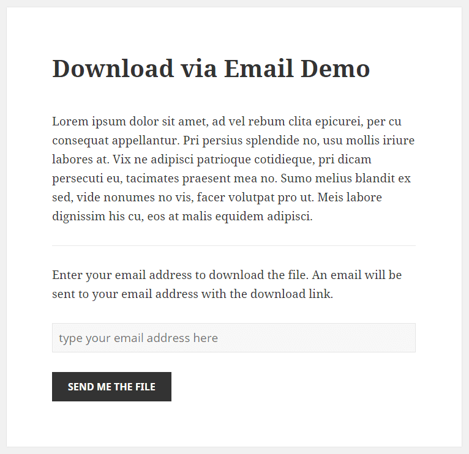
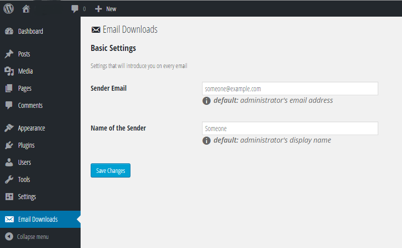

# Download via Email
Embed a form in your pages and posts that accept an email address in exchange for a file to download. The plugin is simpler, quicker, with minimal database usage, and completely in WordPress' way.

----

[**DOWNLOAD**](https://github.com/nanodesigns/download-via-email/releases/download/1.0.1/download-via-email.zip) *stable version 1.0.1*

----

Version 1.0.1 
**Developers:** Mayeenul Islam ([@mayeenulislam](http://twitter.com/mayeenulislam)), Sisir Kanti Adhikari ([@prionkor](http://twitter.com/prionkor)) 
**Tested up to:** 4.3.1 
**License:** [GPLv2](http://www.gnu.org/licenses/gpl-2.0.html) or later

## Installation

1. Download the latest version of the plugin from Github release
2. Unzip the plugin, and Upload `download-via-email` folder to the `wp-content/plugins/` directory
3. Activate the plugin through the 'Plugins' menu in WordPress admin panel
4. Change the necessary settings from the admin panel 'Download via Email' menu page

Now, put the shortcode into page/post 
`[email-downloads file="absolute-path/to/the/file.ext"]`

## Frequently Asked Questions

### What is the shortcode?

<code>[email-downloads file="absolute-path/to/the/file.ext"]</code> is  the shortcode. You have to mention the absolute path of the file to let the user download the file. It is not necessary to upload the file to your WordPress site, it can be any public path, even can be a Dropbox, OneDrive, or Google Drive link

### What type of email is supported as sender?

For now on, only an on-domain email address as sender works, because we used rudimentary WordPress mailer function that works with an on-domain email address like `something@yourdomain.com`. Default is `noreply@yourdomain.com`.

### Will my download link be encrypted?

Yes, we do not believe in sending raw absolute URL of a file, so it's by core encrypted to its maximum strength

### Is the mail HTML-formatted?

Yes, the email is HTML-formatted by default

### For how long the download link will be valid?

By default any link that is generated for an email address would be valid for 12 hours only

### What happen to the email addresses got by the form?

The email addresses are saved in database, and is visible in the admin menu page

### Does the plugin deletes its data on deletion?

Yes, the plugin deletes all its data on uninstallation

### What's the default privilege using the plugin?

Default privilege to the admin menu page is 'administrator'. But there is a filter hook `nano_ed_role`, with this you can add a filter to change the role anytime. :)

## Screenshots

 
_Download via Email - how it will look like at the front end_

 
_Download via Email - the admin panel settings page_

## Changelog

### 1.0.1
* New database `download_via_email` is added to sort stored email correctly

### 1.0.0
* A rudimentary WordPress plugin to enable sending download link to email address
* Completely in WordPress database schema - no other table, no column
* Email storage in `options` table
* Deletion of all the data on uninstallation of the plugin

__________________
Designed &amp; Developed by [**nano**designs](http://nanodesignsbd.com/)